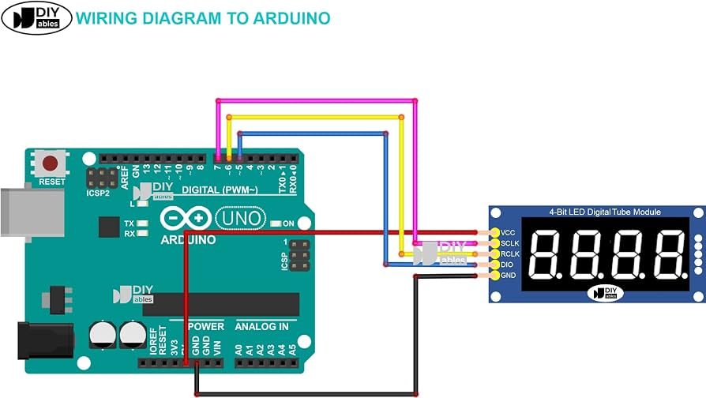

# Arduino biblioteka za 4-digit 7 segment displej koja koristi 74HC595 shift register
***


***
- Moguc je prikaz brojeva izmedju -999 i 9999
- Moguc je prikaz teksta
- Moguc je prikaz vremena

***

U programu se koristi multipleksiranje gde jedan shift register pali odredjene segmente a drugi odredjuje koja po redu cifra se pali

## Mapiranje pinova:

| Function | Pin | Arduino pin |
|---|---|---|
| SCLK (SH_CP) | clock | DIGITAL (7) |
| RCLK (ST_CP) | latch | DIGITAL (6) |
| DIO (DS) | Data input | DIGITAL (5) |
| VCC | 3.3V ili 5V | POWER SUPPLY - 5V |
| GND | Ground - 0V | POWER SUPPLY - GND |

--Moze se koristiti i druga kombinacija digitalnih pinova (ovo je samo primer)

## Primer:

```cpp
#include <Jana_ard_lib.h>

#define SCLK_PIN 7
#define RCLK_PIN 6
#define DIO_PIN 5

Jana_ard_lib display(RCLK_PIN, SCLK_PIN, DIO_PIN);

void setup(){

display.begin();


}

void loop(){

display.print(1234);
display.delay(2000);

display.print("JANA");
display.delay(2000);

display.printTime(10, 34);
display.delay(2000);

display.loop();

}
```